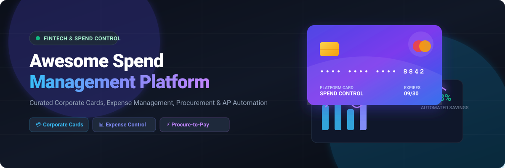

# 💳 Awesome Spend Management Platform 🚀

   

> 💡 **The Definitive Ecosystem Guide to Business Spend Management, Corporate Cards, Procure-to-Pay, Expense Tracking &amp; AP Automation**

Welcome to the **Awesome Spend Management Platform** directory! This repository tracks category-leading **commercial SaaS platforms** and powerful **open-source projects** designed to help finance teams, controllers, procurement leaders, and operations managers automate company spending, enforce budgets, and streamline finance workflows.

---

## 📑 Table of Contents
- [✨ Key Spend Management Categories](#-key-spend-management-categories)
- [🏢 SaaS &amp; Commercial Platforms](#-saas--commercial-platforms)
- [💻 Open-Source GitHub Projects](#-open-source-github-projects)
- [🛠️ Key Open-Source Building Blocks](#%EF%B8%8F-key-open-source-building-blocks)
- [📈 Star History](#-star-history)
- [🤝 How to Contribute](#-how-to-contribute)
- [🔒 Disclaimer](#-disclaimer)

---

## ✨ Key Spend Management Categories
- **💳 Corporate Credit Cards**: Real-time virtual/physical card issuance with automated receipt matching and merchant lockouts.
- **📊 Expense Management**: Automated receipt OCR, policy compliance checks, mobile reimbursement, and multi-level approval workflows.
- **⚡ Procure-to-Pay (P2P)**: Guided purchasing requests, PO generation, three-way matching, and automated supplier invoicing.
- **🤖 AP Automation &amp; Bill Pay**: Automated invoice parsing, approval routing, ACH/wire execution, and ERP ledger sync.

---

## 🏢 SaaS &amp; Commercial Platforms

> 📊 **Market Insights**: The global Business Spend Management (BSM) &amp; Expense Control market is estimated at **$25 Billion to $29 Billion (2025–2026)** growing at an **11–12% CAGR**. The sector is **highly fragmented and competitive** (rather than a winner-take-all market), with distinct category leaders serving SMBs (Ramp, Brex, BILL), mid-market teams (Pleo, Spendesk, Airbase), and global enterprise organizations (Coupa, GEP SMART, Ivalua).

| 🏢 Product | 📝 Description | 💰 Starting Price | 🔒 Free Tier / Free Trial Limits | 📊 Company Size (Valuation / Revenue) |
| :--- | :--- | :--- | :--- | :--- |
| **[Ramp](https://ramp.com/)** | All-in-one finance automation platform combining corporate cards, expense management, bill pay, procurement, and policy controls. | `$0/month` (Free tier; Plus tier `$15/user/month`) | Free forever plan with unlimited corporate cards, receipt matching, expense tracking, and accounting sync (requires US business entity). No paid free trial needed. | `$44.0 Billion` Valuation (`$300M+` ARR) |
| **[Rippling Spend](https://www.rippling.com/spend-management)** | Integrated corporate card, expense management, bill pay, and HR/payroll spend platform. | `$8/user/month` (Core Unity base price + ~$14/user/month spend add-on) | No free forever plan; 6-month free trial promotion available for eligible early-stage startups upon sales request. | `$16.8 Billion` Valuation (`$350M+` ARR) |
| **[Coupa](https://www.coupa.com/)** | Enterprise business spend management suite covering procurement, invoicing, expenses, and supply-chain spend. | `$1,750/month` (`$21,000/year` mid-market BSM tier) | No free forever plan for buyers (free Registered tier for suppliers on Coupa Supplier Portal); 30-day free trial for Coupa Supplier Portal Advanced features. | `$8.0 Billion` Valuation (`$850M+` ARR) |
| **[BILL Spend &amp; Expense (Divvy)](https://www.bill.com/product/spend-and-expense)** | Budget-oriented spend and expense platform with free corporate card options and tight controls. | `$0/month` (100% free software) | Free forever with no subscription or per-user fees; includes unlimited physical/virtual corporate cards, budget controls, and accounting sync. | `$6.0 Billion` Market Cap / `$2.5B` Acq. (`$1.2B` ARR) |
| **[Brex](https://www.brex.com/)** | Corporate card and spend platform for startups and growth companies, offering cards, expenses, bill pay, and travel tools. | `$0/user/month` (Essentials tier; Premium tier `$12/user/month`) | Free forever Essentials plan supporting up to 2 entities with corporate cards, bill pay, and travel booking. No paid free trial. | `$5.2 Billion` Valuation (`$300M+` ARR) |
| **[GEP SMART](https://www.gep.com/software/gep-smart)** | Enterprise procurement software unifying source-to-contract, procure-to-pay, and spend analytics. | `$6,250/month` (`$75,000/year` enterprise starting tier) | No free forever plan; 30-day enterprise sandbox demo / trial upon request. | `$2.5 Billion` Valuation (`$300M+` ARR) |
| **[Zip](https://ziphq.com/)** | Intake-to-procure platform that streamlines purchasing requests, approvals, vendor onboarding, and contracts. | `$2,000/month` (`$24,000/year` Starter Edition minimum commitment) | No free forever plan; 14-day guided sandbox trial available upon sales request. | `$2.2 Billion` Valuation (`$60M+` ARR) |
| **[Pleo](https://www.pleo.io/)** | European smart corporate card and expense management platform offering expense capture and real-time visibility. | `£8/user/month` (Start plan; Build plan `£14/month`) | 14-day free trial on paid plans with full features; free starter plan for up to 3 users in select markets. | `$1.6 Billion` Valuation (`$100M+` ARR) |
| **[Ivalua](https://www.ivalua.com/)** | Cloud-based Source-to-Pay and spend management suite serving enterprises with modular procurement applications. | `$12,500/month` (`$150,000/year` enterprise deployment tier) | No free forever plan; 30-day tailored enterprise proof-of-concept / sandbox trial upon sales request. | `$1.5 Billion` Valuation (`$120M+` ARR) |
| **[Emburse](https://www.emburse.com/)** | Enterprise expense and travel &amp; expense management suite with policy enforcement and global capabilities. | `$8/user/month` (Emburse Spend Basic; Plus tier `$12/user/month`) | No free forever plan; 30-day free trial available for Emburse Spend (14-day trial for Professional tier). | `$1.2 Billion` Valuation (`$150M+` ARR) |
| **[Spendesk](https://www.spendesk.com/)** | European spend management platform focused on cards, expenses, invoices, and spend control with approval workflows. | `€299/month` (~`$300/month` Starter tier) | No free forever plan; 7-day interactive product demo available upon request. | `$1.14 Billion` Valuation (`$50M+` ARR) |
| **[Payhawk](https://payhawk.com/)** | All-in-one spend management solution combining corporate cards, expense management, and AP automation. | `£149/month` (Growth plan for smaller teams) | No free forever plan; 7-day free trial available (read-only card linking &amp; spend visibility; card issuing excluded). | `$1.0 Billion` Valuation (`$30M+` ARR) |
| **[Moss](https://getmoss.com/)** | European corporate credit card and spend management platform with automated invoice management and accounting sync. | `€0/month` (Free tier; modular paid platform fees) | Free forever plan for up to 3 users and up to 20 invoices/month (includes unlimited virtual cards). 14-day free trial for paid tiers. | `$570 Million` Valuation (`$20M+` ARR) |
| **[Medius](https://www.medius.com/)** | AI-driven AP automation and spend management platform automating invoice capture, procurement, and payments. | `$2,499/month` (AP Essentials starting tier) | No free forever plan; 14-day interactive guided product trial available upon request. | `$500 Million` Valuation (`$70M+` ARR) |
| **[Airbase](https://www.airbase.com/)** | Unified spend management platform covering guided procurement, AP automation, corporate cards, and expense reimbursements. | `$99/month` (Starter package tier) | No free forever plan; 14-day free trial / guided demo available upon request. | `$325 Million` Acquisition (`$30M+` ARR) |
| **[Procurify](https://www.procurify.com/)** | Mid-market procurement platform offering PO management, real-time budget tracking, approvals, and spend controls. | `$1,000/month` (Core purchasing suite) | No free forever plan for approvers (free basic requester licenses included); 14-day guided trial available upon request. | `$300 Million` Valuation (`$25M+` ARR) |
| **[Rho](https://www.rho.co/)** | Commercial banking and automated spend management platform offering corporate cards, AP bill pay, and accounting sync. | `$0/month` (100% free software &amp; business banking) | Free forever with $0 software subscription or per-user fees; includes unlimited corporate cards, AP bill pay, and expense controls (monetized via card interchange). | `$250 Million` Valuation (`$20M+` ARR) |
| **[Mesh Payments](https://www.meshpayments.com/)** | Corporate spend and card platform with pre-approval workflows, automated expense matching, and travel spend controls. | `$0/month` (Pro plan for up to 3 users; Premium plan `$10/user/month`) | Free forever Pro plan for up to 3 users (includes unlimited virtual cards, automated reconciliation, and accounting sync). | `$200 Million` Valuation (`$15M+` ARR) |
| **[Teampay](https://www.teampay.co/)** | Distributed spend management software providing proactive approval workflows and pre-approved virtual cards. | `$15/user/month` (Starter tier base package) | No free forever plan; 14-day interactive product demo / trial available upon request. | `$150 Million` Acquisition (`$15M+` ARR) |
| **[Precoro](https://precoro.com/)** | Mid-market procurement software automating approval workflows, purchase orders, and AP. | `$499/month` (Core plan billed annually; Automation plan `$999/month`) | No free forever plan; 14-day free trial available with full feature access (no credit card required). | `$50 Million` Valuation (`$10M+` ARR) |

---

## 💻 Open-Source GitHub Projects

> 🔓 **Open-Source Context**: Dedicated open-source corporate-card issuing platforms are rare due to financial card-network regulations. However, full-featured open-source ERP systems (ERPNext, Odoo) and dedicated self-hosted invoice/expense applications offer complete procurement, approval workflow, and accounting foundations. Projects below are sorted by GitHub star counts (descending).

- **[Maybe](https://github.com/maybe-finance/maybe)**   
  Open-source personal and small-team financial management app offering real-time asset, expense, and budget tracking.

- **[Odoo Community](https://github.com/odoo/odoo)**   
  Popular open-source business suite including expense management, purchase, accounting, and approval apps that can be combined into a spend control stack.

- **[ERPNext](https://github.com/frappe/erpnext)**   
  Fully open-source ERP with strong procurement, purchasing, expense claims, approval workflows, accounting, and inventory modules. One of the most complete open-source foundations for spend-related processes.

- **[Firefly III](https://github.com/firefly-iii/firefly-iii)**   
  Self-hosted financial manager providing detailed budget tracking, expense categorization, and rule-based transaction automations for small operations.

- **[Invoice Ninja](https://github.com/invoiceninja/invoiceninja)**   
  Open-source invoicing, expense management, purchase order tracking, and payment processing application for small businesses and freelancers.

- **[Akaunting](https://github.com/akaunting/akaunting)**   
  Online open-source accounting and expense management software designed for small businesses to track expenses, manage vendor invoices, and control cash flow.

- **[Dolibarr ERP &amp; CRM](https://github.com/Dolibarr/dolibarr)**   
  Open-source ERP and CRM system equipped with expense report submission, vendor invoice approvals, purchasing workflows, and financial reporting modules.

- **[Crater](https://github.com/crater-invoice/crater)**   
  Open-source invoice and expense tracking application built for small businesses and freelancers to manage billing and spending seamlessly.

- **[InvoicePlane](https://github.com/InvoicePlane/InvoicePlane)**   
  Self-hosted open-source application for managing quotes, invoices, payments, and client expenses with custom approval tracking.

- **[Actual Budget](https://github.com/actualbudget/actual)**   
  Privacy-focused, self-hosted envelope budgeting system with automated bank sync capabilities suitable for lightweight team spend control.

- **[Apache OFBiz](https://github.com/apache/ofbiz)**   
  Enterprise automation suite featuring robust purchasing, vendor management, inventory, and order fulfillment modules for complex procurement.

- **[metasfresh](https://github.com/metasfresh/metasfresh)**   
  Open-source ERP system with purchasing, procurement, accounting, and inventory management features designed for growing businesses.

- **[ERPNext Expenses Extensions](https://github.com/kid1194/erpnext_expenses)**   
  Community modules and custom scripts extending ERPNext with specialized expense claim workflows and multi-level approval rules.

---

## 🛠️ Key Open-Source Building Blocks

- **⚙️ Approval Workflow Engines**: Open-source BPM and workflow engines (Camunda, Temporal) used to build multi-level spend approval logic.
- **🏦 Banking &amp; Open Banking Integrations**: Connectors and APIs linking self-hosted ERPs to financial institutions (Plaid, Nordic API Gateway).
- **📄 Document &amp; Invoice OCR**: Self-hosted OCR engines (Tesseract OCR, Paperless-ngx) for automated receipt parsing and invoice extraction.
- **📊 Spend Analytics &amp; Budgeting**: BI and dashboard tools (Metabase, Apache Superset) connected to open-source database schemas.

---

## 📈 Star History

---

## 🤝 How to Contribute

Contributions are warmly welcomed! Help build the most comprehensive directory for business spend control:

1. 🍴 **Fork** this repository.
2. 📝 **Add/Update** entries in `README.md` maintaining table formatting and star count badges.
3. 🔗 Include official link, factual 1-2 sentence description, pricing tier, and free trial/tier limits.
4. 🚀 **Submit a Pull Request** with a brief summary of your updates.

---

## 🔒 Disclaimer

- This directory is **community-curated** for educational and research purposes.
- Business spend management platforms process critical payment credentials and sensitive financial ledgers. Always ensure robust security, role-based access control, audit logs, and SOC2/PCI-DSS compliance.

---

⭐ **Star this repository if you find it helpful for your finance stack research!**
